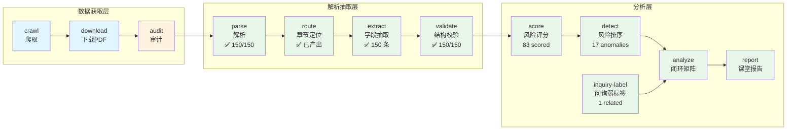

# 项目架构与决策文档

> 本文档回答三个核心问题：**整个项目做什么**、**每一步为什么这样做**、**各阶段之间的数据如何流动**。README 面向"运行者"（怎么用），本文档面向"开发者"（为什么这样设计）。
> 本文档只记录**已经跑通或正在推进的阶段**，不过度前置未验证的设计。

---

## 1. 项目全景图

### 1.1 一句话目标

从巨潮资讯网公开年报 PDF 中自动抽取研发资本化相关财务字段，构建四维度评分模型识别资本化激进公司，并通过交易所实际发出的问询函验证模型有效性。

### 1.2 当前已验证的 Pipeline 流程

official API 路线已完成 `crawl → download → audit` 全链路 150/150 验证；MinerU API batch 已完成 150/150 年报 Markdown；extract 完成后，2026-06-15 已从 `validate` 一次跑通到 `report`。当前结果是：validate 150/150、score 83 scored / 67 no-score（未评分）、detect 17 anomalies、inquiry-label 150 条（1 条 related）、analyze 得到 TP=0 / FP=17 / TN=132 / FN=1。



### 1.3 数据流全景

| 阶段 | 输入 | 输出 | 格式 | 路径 |
| ------ | ------ | ------ | ------ | ------ |
| crawl | `configs/crawl.yaml` | metadata | CSV | `data/metadata/metadata.csv` |
| download | metadata.csv | PDF 文件 | 二进制 | `data/pdf/{doc_id}.pdf` |
| audit | PDF + metadata | 审计报告 | Markdown | `outputs/dataset_check_report.md` |
| parse | PDF 文件 | 解析文本 | Markdown | `data/parsed/{doc_id}.md` |
| route | Markdown | 章节切片 | JSONL | `data/sections/{doc_id}_sections.jsonl` |
| extract | 章节切片 | 字段证据 | JSONL | `data/extracted/records.jsonl` |
| validate | 字段证据 | 校验后记录 | JSONL | `data/validated/records.jsonl` |
| score | 校验后记录 | 风险评分 | JSONL | `data/scored/records.jsonl` |
| detect | 风险评分 | 异常清单 | CSV | `data/anomaly/anomaly_list.csv` |
| inquiry / inquiry-download | 年报 metadata | 问询候选与 PDF | CSV + PDF | `data/inquiry/` |
| inquiry-label | 问询候选与 PDF | company-year 弱标签 | JSONL | `data/inquiry/inquiry_records.jsonl` |
| analyze | score + inquiry label | 混淆矩阵与指标 | JSON | `outputs/loop_evaluation.json` |
| report | evaluation JSON | 展示报告（自动版） | Markdown | `outputs/final_report_auto.md` |

当前后段已跑通，但问询标签仍是标题、PDF 首页标题和 PDF 前 5 页关键词弱标签；单独命中“研发”也会判相关。报告结论应强调“闭环可运行、风险名单可解释、监管预测待增强”。

---

## 2. 课程要求映射

### 2.1 Week 12 — 巨潮数据抓取

> 讲义依据：`../00-课程讲义/Week12-巨潮数据抓取/讲义.md` §4.1–4.3，Lab §5.1–5.7

| 讲义要求 | 代码实现 | 交付物 | 最低标准 |
| ---------- | ---------- | -------- | ---------- |
| 抓取规格 `crawl_spec.md` | `docs/crawl_spec.md` | 抓取规格文档 | 含股票池、时间、关键词、限速 |
| 公告查询接口调用 | `src/crawl/cninfo_api.py` | metadata.csv | ≥50 条记录，字段完整 |
| PDF 下载 | `src/download/downloader.py` | `data/pdf/*.pdf` | 与 metadata 一一对应 |
| 数据质量检查 | `src/audit/auditor.py` | `outputs/dataset_check_report.md` | 检查 5 项以上质量指标 |
| 限速策略 | `configs/crawl.yaml` | 配置文件 | 单线程、3s 间隔 |

**关键约束**：

- `metadata.csv` 是后续所有步骤的主键。
- `doc_id` 只要求全局唯一且后续阶段沿用；official API 后端使用 `{stock_code}_{stock_name}_{report_year}年报`，前端 AJAX 旧后端仍可使用股票代码 + 日期 + 标题哈希。
- `download_status` 记录 success/failed，失败时 `error_message` 不能留空。
- 只有 PDF 文件夹而没有 metadata = 不合格提交。

### 2.2 Week 13 — MinerU 解析

> 讲义依据：`../00-课程讲义/Week13-MinerU解析与Schema抽取/讲义.md` §4.1–4.4

| 讲义要求 | 代码实现 | 交付物 | 最低标准 |
| ----------------- | -------------------------------- | -------------------- | ------------------------------- |
| MinerU PDF 解析 | `src/parse/mineru_parser.py` | `data/parsed/*.md` | 所有 PDF 解析为非空 Markdown |

**状态**：本地 MinerU CLI 已保留为 fallback；当前 150 份年报已使用 MinerU 精准解析 API 的 `api-batch` backend 全量解析成功，最终 Markdown 写入 `data/parsed/{doc_id}.md`。详见 `docs/HANDOFF.md` §11.10。

### 2.3 Week 14–16 — 工作流框架、评估与展示

> 状态：MVP 已跑通。`src/main.py` 注册并实现 `score`、`detect`、`inquiry-label`、`analyze`、`report`，最终输出 `outputs/loop_evaluation.json` 和 `outputs/final_report_auto.md`。下一步不是搭框架，而是人工复核字段缺失样本与问询全文标签。

---

## 3. 数据契约

### 3.1 metadata.csv（crawl → download 的契约）

```csv
doc_id,stock_code,stock_name,market,announcement_title,announcement_type,publish_date,url,pdf_url,local_pdf_path,download_status,source,crawl_time,error_message,notes
600276_恒瑞医药_2022年报,600276,恒瑞医药,sh,恒瑞医药2022年年度报告,年度报告,2023-04-20,https://...,https://...,data/pdf/600276_恒瑞医药_2022年报.pdf,success,cninfo_official_api,2026-06-09T10:00:00Z,,
```

**关键规则**：

- `doc_id` 是全局唯一主键。
- `download_status` ∈ {`success`, `failed`, `skipped`}。
- `error_message` 在失败时必须非空，成功时必须为空。
- `source` 标识抓取后端，当前可为 `cninfo` 或 `cninfo_official_api`。

### 3.2 MinerU Markdown 格式（parse 输出）

MinerU 解析后的 Markdown 文件预期结构：

```markdown
# 第一节 重要提示、目录和释义
...

# 第二节 公司简介和主要财务指标
...

## 研发投入
...

# 第十节 财务报告
...

## 七、合并财务报表项目注释
### 开发支出
...
```

**关键约定**：

- 一级标题 `#` 对应文档主章节。
- 二级标题 `##` 对应子章节。
- 表格以 Markdown 表格格式保留。
- 后续 route 阶段将基于关键词定位上述章节。

---

## 4. 关键设计决策

### 4.1 为什么用 MinerU 而非 PyPDF/pdfplumber？

| 维度 | MinerU | PyPDF / pdfplumber |
| ------ | -------- | ------------------- |
| 表格解析 | 保留 Markdown 表格结构，可读性好 | 需要额外处理，格式混乱 |
| 版面识别 | 自动识别标题层级、段落、表格 | 纯文本流，丢失版面信息 |
| 复杂排版 | 支持年报中的多栏、图文混排 | 不支持 |
| 输出质量 | 可直接用于 LLM 输入 | 需要大量清洗 |

**决策**：MinerU 解析质量显著优于纯文本提取方案。本项目数据量（150 份）可本地处理，但长年报本地解析耗时较高；当前主路线改为 MinerU API batch，保留本地 CLI 作为 API 不可用时的 fallback。

### 4.2 为什么用 uv + pyproject.toml 管理依赖？

- `uv` 是 Rust 编写的 Python 包管理器，比 pip 快 10-100 倍。
- `pyproject.toml` 是 PEP 518 标准，统一了依赖声明、构建配置、工具配置。
- 通过 lock 文件确保可复现。
- 团队成员无需手动管理虚拟环境，`uv sync` 一键搞定。

### 4.3 为什么先用规则评分而不是监督学习？

当前研发资本化相关问询标签仍弱，正样本太少，直接训练分类器会把关键词噪声当规律。因此后段先用可解释的金融规则模型，把同业偏离、跨期变化、披露模糊度和恒等式置信度合成 `aggressiveness_score`。

这样做的好处是课堂上能解释每一条异常为什么被挑出来，也能把抽取质量问题和公司风险分开。
完整公式、阈值与启发式参数审计表见 [`docs/methodology.md`](docs/methodology.md)。

当前 validate 已用 5% 恒等式阈值拦截严重不一致记录，所以 `identity_error` 异常类型在当前阈值组合下基本不会触发；异常名单是混合信号，少数资本化率为 0% 的样本也可能因模糊度或跨期变化入选。

行业归属优先读 `configs/crawl.yaml` 中各公司显式配置的 `industry` 字段（20 医药制造 / 20 电子设备 / 10 软件信息）；仅当缺失显式 `industry` 时才回退到公司排列顺序启发式，后续应移除顺序 fallback，避免调整股票池顺序后行业百分位错位。

### 4.4 新增的两项可靠性增强

1. **确定性表格提取**：新增 `src/extract/rd_table_extractor.py`，从 MinerU Markdown 的 HTML 表格中解析研发投入情况表、开发支出明细表和无形资产附注，输出结构化数值；`src/validate/validator.py` 在 LLM 字段缺失时用表格值回填，并标记 `table_fallback`。
2. **问询标签 v2**：`src/analysis/inquiry_labeler.py` 不再用简单关键词 OR 判定相关，而是按 `document_role` 排除回复类公告，通过 Tier-1/Tier-2 关键词剪枝，必要时用 LLM 语义二分类确认函件是否实质针对研发资本化。

---

## 5. 错误处理与 Resume 策略

### 5.1 每个阶段的失败行为

| 阶段 | 失败行为 | Resume 策略 | 缓存位置 |
| ------ | ---------- | ------------- | ---------- |
| crawl | 记录 error_message，继续下一条 | `data/crawl_cache.json` | 已查询的公司-年度组合 |
| download | 重试 3 次后标记 failed | metadata.csv `download_status` | 已下载且校验通过的 PDF |
| audit | 生成报告，不中断 Pipeline | — | — |
| parse | 记录失败 doc_id，继续下一条 | `data/parsed/parsed_docs.jsonl` / `data/parsed/mineru_api_tasks.jsonl` | 已解析 Markdown、API segment 和结果 zip |
| score | 字段缺失时输出 `null` 或 partial score | `data/scored/records.jsonl` | `data_quality_notes` 记录缺失原因 |
| detect | 分数为空的记录不标异常 | `data/anomaly/anomaly_list.csv` | 只对可评分记录排序 |
| inquiry-label | 无候选或无关键词命中也保留 company-year | `data/inquiry/inquiry_records.jsonl` | 支持 FN/TN 计算 |
| analyze/report | 指标样本不足时保守解释 | `outputs/loop_evaluation.json` / `outputs/final_report_auto.md` | 保留 caveat |

### 5.2 `--stage` 独立运行的设计意图

```powershell
# 场景 1：首次运行，从头开始
uv run python src/main.py --stage all

# 场景 2：crawl 中途断网，重跑 crawl（自动跳过已完成）
uv run python src/main.py --stage crawl

# 场景 3：验证 crawl → download → audit mini pipeline
uv run python src/main.py --stage crawl --limit 1
uv run python src/main.py --stage download --limit 3
uv run python src/main.py --stage audit

# 场景 4：补跑 parse 阶段（推荐 API batch）
uv run python src/main.py --stage parse --parse-backend api-batch --limit 1
```

每个阶段**只读取前一阶段的输出，不依赖内存状态**。

### 5.3 数据质量检查清单（audit 阶段）

| 检查项 | 通过标准 | 失败处理 |
| -------- | ---------- | ---------- |
| metadata.csv 非空 | 行数 > 0 | 报错，终止 Pipeline |
| PDF 数量 = metadata 行数 | 误差 = 0 | 标记 missing_pdf |
| 无重复 doc_id | 唯一值 = 总行数 | 标记 duplicate_doc_id |
| 所有 PDF 存在且可读 | 文件大小 > 100KB + `%PDF` 头 | 标记 corrupted_pdf |
| 标题包含关键词 | 包含"年报"或"年度报告" | 标记 title_mismatch |
| download_status 覆盖 | success + failed = 总行数 | 标记 missing_status |

---

## 6. 模块职责矩阵

> 各阶段的**职责、成功标准、失败处理、日志约定**详见 [`docs/workflow_design.md`](workflow_design.md)。本文档只保留输入、输出和当前状态。

| 模块 | 输入 | 输出 | 对应讲义 | 状态 |
| ------ | ------ | ------ | ---------- | ------ |
| `crawl` | `configs/crawl.yaml` | `metadata.csv` | Week 12 | ✅ 150/150 已跑通 |
| `download` | `metadata.csv` | `data/pdf/*.pdf` | Week 12 | ✅ 150/150 已跑通 |
| `audit` | `metadata.csv` + PDF | `dataset_check_report.md` | Week 12 Lab | ✅ 150/150 已跑通 |
| `parse` | `data/pdf/*.pdf` | `data/parsed/*.md` | Week 13 | ✅ 150/150 已跑通 |
| `route` | `data/parsed/*.md` | `data/sections/*.jsonl` | Week 13 | ✅ 已生成章节切片 |
| `extract` | 章节切片 + Prompt | `data/extracted/records.jsonl` | Week 13 | ✅ 150 条已产出，缺字段保留 `null` |
| `validate` | `records.jsonl` | `data/validated/records.jsonl` | Week 13 | ✅ 150/150 passed |
| `score` | `records.jsonl` | `data/scored/records.jsonl` | Week 14 | ✅ 83 scored / 67 no-score |
| `detect` | `records.jsonl` | `data/anomaly/*.csv` | Week 14 | ✅ 17 条异常 |
| `inquiry` | `metadata.csv` + CNINFO 前端公开查询 | `data/inquiry/inquiry_candidates.csv` | 扩展 | ✅ discovery 已跑完，当前固定 28 条候选 |
| `inquiry-download` | `data/inquiry/inquiry_candidates.csv` | `data/inquiry/pdf/*.pdf` + `outputs/reports/inquiry_orphan_pdf_report.md` | 扩展 | ✅ 28/28 候选 PDF 已下载，orphan=0 |
| `inquiry-label` | 候选 PDF + 年报 metadata | `data/inquiry/inquiry_records.jsonl` | 扩展 | ✅ 150 条标签，1 条 related |
| `analyze` | 配对结果 | `loop_evaluation.json` | 扩展 | ✅ TP=0 / FP=17 / TN=132 / FN=1 |
| `report` | 评估指标 | `final_report.md` | Week 16 | ✅ 课堂展示报告已生成 |

---

## 7. 变更日志

变更历史统一记录在 [`docs/HANDOFF.md`](HANDOFF.md)。
