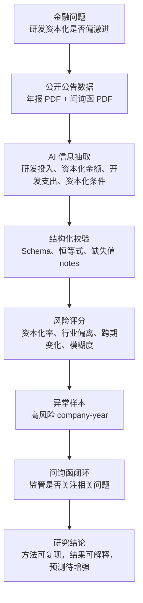
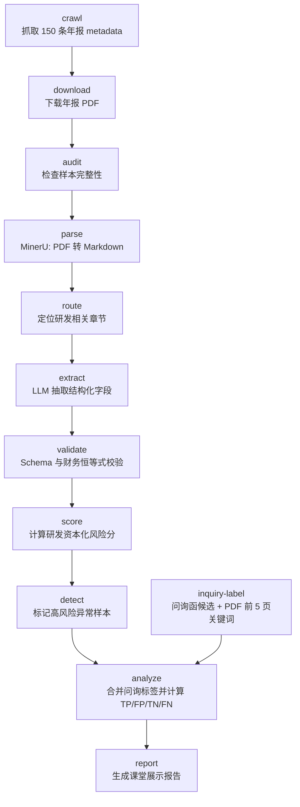
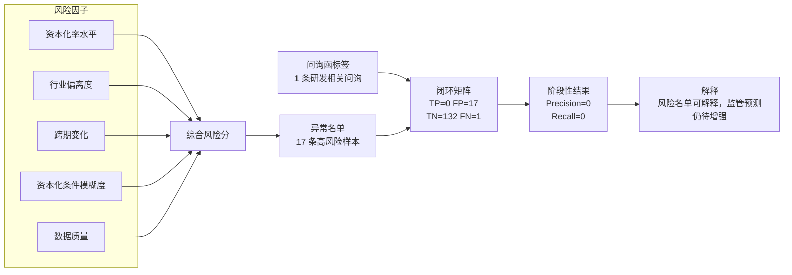

# 研发资本化风险排序与问询函可行性测试报告

> 课堂展示版 · 生成时间：2026-06-21T03:18:16

## 一句话结论

这个项目想回答一个很具体的问题：有些公司把研发支出转成资产，这里面哪些年份看起来更激进？我们先从年报里把研发资本化数据抽出来，再给每个 company-year 打风险分，最后看交易所问询函有没有问到类似问题。

目前还不能说模型已经能预测问询函。比较实在的进展是：年报 PDF 已经能变成结构化指标，风险分已经能排出一批重点样本，问询函也能接进来做验证。现在的数据看起来更像是少数年份风险很高，而不是整个样本都高。

## 课堂展示摘要

研究问题很简单：上市公司把研发支出资本化时，哪些公司年份更值得被单独拎出来看？这些高风险样本，交易所后面有没有在问询函里追问类似问题？

这次先做出了两件事。第一，流程跑通了：年报 PDF 可以解析、切章节、抽字段、校验、评分、找异常，再和问询函标签合并。第二，已经有了一个初步现象：研发资本化风险不是平均摊在所有公司身上，更多集中在少数 company-year。

基于当前全量样本快照，系统评估了 `150` 条年报记录，覆盖 `150` 条问询标签中的 `100%`。可计算资本化率的记录有 `60` 条，平均资本化率为 `11.57%`，中位数只有 `2.67%`。这说明少数高资本化样本拉高了平均值；如果只看平均数，会误以为样本整体都比较激进。

风险排序标出了 `17` 条高风险 company-year，占全样本 `11.33%`。这个数量是从 `83` 条可评分记录里取前 20% 左右得到的，不是直接对 150 条全样本取分位数。异常组平均资本化率为 `23.81%`，非异常组为 `6.73%`；异常组平均风险分为 `46.15`，非异常组为 `15.25`。这说明评分器整体能把更值得复核的样本排到前面，但异常名单是行业偏离、跨期变化和披露模糊度的混合信号。

问询函这边要说得保守一点：`150` 个年报样本中有 `10` 个样本发现问询候选，`1` 个样本命中研发资本化相关关键词；在已评估的 `150` 条记录中，模型命中 `0` 条真实相关问询，漏掉 `1` 条，precision 为 `0`，recall 为 `0`。也就是说，闭环已经接上了，但预测效果还弱。

## 项目到底在做什么

很多上市公司会把一部分研发支出资本化。这个做法本身合法，也可能确实对应项目进入开发阶段。问题在于，它会把当期费用往以后推，让当期利润更好看，所以也留下了会计判断空间。这个项目不直接判定违规，只做风险排序：资本化率高、突然跳升、条件写得笼统、数据关系不稳定的样本，排到前面。

金融上，我们关心的是会计估计和盈余管理风险。计算机这边，麻烦在于年报和问询函都是 PDF，里面的信息不能直接拿来算。AI 的作用是把研发披露抽成字段；但 LLM 抽出来的东西不能直接信，所以后面要接 Schema、恒等式校验和缺失值标注。

换句话说，这个项目做的是一条研究流水线：抓公告、解析 PDF、定位章节、抽字段、校验、算指标、找异常、匹配问询函，再解释结果。最后留下的不只是一个分数，还有每一步的中间文件，方便复查。

### 图 1：研究逻辑总览

这张图把整个思路摊开：先把金融问题说清楚，再把公告文本变成数据，最后用问询函看风险信号有没有现实对应。



## 研究设计：原因、方法、执行、结果

### 1. 因为什么原因做这个题目

我选研发资本化，是因为它刚好卡在创新投入和利润确认之间。研发投入代表公司在做新项目，但这笔钱是当期费用化，还是先放进资产里以后再摊销，会直接影响利润表。对研发密集型公司来说，这里有真实业务判断，也有调节利润的空间。

所以这个题目不是预测股价，也不是普通文本分类。它用公开年报里的会计信息筛风险，再看交易所有没有追问。课堂上可以直接说：我们研究的是“研发投入从费用变成资产时，哪些公司年份更值得看一眼”。

### 2. 为什么选择这个方法

纯人工能做，但很慢。样本有 50 家公司、3 个年度、150 份年报，还要查对应窗口期内的问询函。直接上表格模型也不行，因为关键字段散在 PDF 里：研发投入金额、资本化金额、开发支出、资本化条件，还有问询函里到底问了什么。

所以方法拆成三块：规则指标、LLM 抽取、问询函验证。规则指标保证金融含义，资本化率、行业偏离、跨期变化都能解释。LLM 负责把年报披露抽成字段。问询函用来做现实检验：如果高风险样本更容易被问到，风险分就有一些监管解释力。

### 3. 实际做了什么

具体做法是这样的。先从巨潮资讯网收集 50 家研发密集型上市公司 2021-2023 年年报，样本框架是 150 个 company-year。然后用 MinerU 把年报 PDF 转成 Markdown，再用章节路由找到研发支出、开发支出、无形资产和会计政策附近的文字。接着让 LLM 抽取研发投入、资本化金额、费用化金额、开发支出期初期末数和资本化条件。最后用 Pydantic Schema、恒等式校验和缺失值 notes 卡住 AI 输出，不能判断的地方就留空。

拿到结构化字段后，再算风险分。资本化率越高、同行里越靠前、比上一年变动越异常，分数就越高；资本化条件写得越笼统，模糊度分也越高。数据关系对不上时，代码不会直接加风险，而是降低这条记录的置信度。然后只在有风险分的记录里取前段样本标成异常。问询函这边先做 MVP：抓年报后窗口期内的问询函、监管函和回复公告，再用标题、PDF 首页标题和 PDF 前 5 页关键词判断它是否和研发资本化有关。最后把两边合并，得到 TP、FP、TN、FN。

### 4. 得到了什么结果

当前快照已经评估 `150` 条年报记录，其中 `60` 条可以计算资本化率，`83` 条可以得到风险分。资本化率平均值为 `11.57%`，中位数为 `2.67%`，说明样本不是整体高资本化，而是少数高值样本拉高均值。风险排序最终标出 `17` 条高风险样本，占已评估样本 `11.33%`。

异常组和非异常组的差异比较明显：异常组平均资本化率为 `23.81%`，非异常组为 `6.73%`；异常组平均风险分为 `46.15`，非异常组为 `15.25`。这说明评分规则整体上把更值得复核的样本推到了前面。但风险分是混合信号，个别资本化率为 0% 的样本也可能因为披露模糊度或跨期变化进入异常名单，不能直接说成激进资本化。

问询函这边更需要谨慎。150 个年报样本中，当前发现 `10` 个有问询候选，`1` 个命中研发资本化相关关键词。与风险排序名单合并后，得到 TP=`0`、FP=`17`、TN=`132`、FN=`1`，precision=`0`，recall=`0`。这说明现在的成果是闭环能跑、风险名单能解释；预测监管问询这件事，还没到可以下结论的时候。

### 5. 这些结果说明什么

这些数字给我的判断是：第一，研发资本化风险更像尾部风险，不是全样本平均风险。第二，行业差异不能忽略，医药、软件和电子设备不能硬套同一个阈值。第三，异常名单有实际用处，它把人工复核范围从 `150` 个 company-year 缩到 `17` 个重点样本。第四，问询函验证暂时没有给出强预测效果，可能是部分财务字段仍为空，也可能是关键词标签太粗，还可能是交易所问询本来就不只问研发资本化。

所以课堂展示时我会这样收束：项目已经把年报文本、财务风险评分和问询函验证接起来了；现有样本显示，风险主要集中在少数尾部样本；问询函闭环能跑，但还需要更完整的抽取和更细的标签，才能做最终实证判断。

## 项目内容

### 研究对象

- 数据范围：50 家研发密集型上市公司，覆盖 2021、2022、2023 三个年报年度，理论样本为 150 个 company-year。
- 行业范围：医药制造、电子设备、软件信息三个研发投入较高的行业。
- 主数据：巨潮资讯网公开年报 PDF。
- 外部验证：年报发布后 180 天内的问询函、问询函回复、关注函、监管工作函等候选公告。

### 研究问题与方法

核心问题是：哪些研发资本化特征更容易与监管问询相关？

- 高资本化率是否意味着更高监管关注风险？
- 资本化率突然上升是否比单年高值更值得警惕？
- 资本化条件描述越模糊，公司是否越容易被问询？

## 阶段性研究结论

### 结论一：研发资本化风险具有明显尾部特征

当前可计算资本化率样本的平均值为 `11.57%`，中位数只有 `2.67%`。这说明多数 company-year 的研发资本化率较低或接近零，少数高值样本把平均数拉了上去。课堂上可以直接讲：这个项目看到的不是普遍异常，而是尾部样本特别值得看。

### 结论二：行业背景会显著影响资本化率解释

当前样本按行业计算的平均资本化率为：医药制造 15.26%；电子设备 7.62%；软件信息 19.09%。软件信息和医药制造样本高于电子设备样本。这个差异很好理解：不同产业的研发周期、成果形态、无形资产确认方式都不一样。所以评分不能只看绝对资本化率；同样是 20%，放在不同行业里含义可能不同。这里的行业归属来自 `configs/crawl.yaml` 显式 `industry` 字段（20 医药制造 / 20 电子设备 / 10 软件信息），后续如调整股票池需同步维护该字段。

### 结论三：异常名单抓住了更激进的会计处理样本

异常组平均资本化率为 `23.81%`，非异常组为 `6.73%`；异常组平均风险分为 `46.15`，非异常组为 `15.25`。这个差距说明，风险名单不是随便挑出来的。它把资本化率、行业位置、跨期变化和披露模糊度揉在一起，排出了一批更该复核的样本。需注意：风险分是混合信号，名单中存在资本化率为 0% 仍被标异常的样本；这类记录通常由模糊度或跨期变化驱动，不代表激进资本化，必须回原文区分。

### 结论四：问询函验证说明模型还处在 MVP 阶段

在已评估样本中，模型得到 `0` 个 TP、`17` 个 FP、`132` 个 TN、`1` 个 FN。precision 为 `0`，recall 为 `0`。这个结果不能用来吹预测准确率。它反而提醒我们：财务异常信号和交易所问询函不是一一对应的。交易所可能问收入、商誉、资金占用、并购，研发资本化只是其中一类。后面要做全文语义标签，才好判断研发资本化风险到底有没有触发监管关注。

### 结论五：这个项目把年报文本变成了能复查的数据

如果全靠人工，要一份一份看年报和问询函，很难在课堂项目时间里做完。本项目用 PDF 解析、LLM 抽取、Schema 校验和规则评分，把公告文本转成可计算数据，再用问询函做复核。当前结论还早，但这套流程已经能复跑、能查中间结果，也能继续换更好的标签方法。

## 金融逻辑

研发支出有两种会计处理方式：费用化会直接进入当期损益，资本化会先形成资产并在未来摊销。资本化比例越高，当期利润压力越小，但判断空间也更大。对于研发密集型企业，资本化可能反映真实项目进展，也可能成为调节利润的手段。

本项目不把“资本化”简单等同于违规，而是从四个角度判断激进程度：

- **资本化率水平**：资本化金额 / 研发投入，反映本年度会计处理激进程度。
- **行业偏离度**：同一年度、同行业内部比较，减少行业差异干扰。
- **跨期变化**：与上一年相比的资本化率变化，捕捉突然跳升。
- **条件模糊度与数据质量**：资本化条件越抽象，判断空间越大；恒等式偏差越大，抽取置信度越低。

## 数学和金融建模

这一版没有训练复杂的监督学习模型。原因很现实：当前问询函标签还是 MVP，正负样本太少，直接训练分类器很容易学到噪声。所以这里先用可解释的金融规则模型，把几个能讲清楚的信号合成一个风险分。这个分数叫 `aggressiveness_score`，含义是“这个 company-year 的研发资本化处理看起来有多激进”。

### 1. 样本和变量怎么定义

模型的观察单位是 `company-year`，也就是某家公司某一年的年报。样本设计是 50 家研发密集型上市公司 × 2021、2022、2023 三个年度，理论上有 150 条记录。

| 符号 | 字段 | 金融含义 |
| --- | --- | --- |
| `RD_i,t` | `rd_expense_total` | 公司 i 在 t 年披露的研发投入总额。 |
| `CAP_i,t` | `rd_capitalized_amount` | 研发支出中被资本化的金额。 |
| `EXP_i,t` | `rd_expensed_amount` | 研发支出中当期费用化的金额。 |
| `CR_i,t` | `capitalization_rate` | 研发资本化率，核心风险指标。 |
| `DEV_OPEN_i,t` | `dev_cost_opening` | 开发支出期初余额。 |
| `DEV_CLOSE_i,t` | `dev_cost_closing` | 开发支出期末余额。 |
| `COND_i,t` | `capitalization_condition` | 年报中对资本化条件的文字说明。 |
| `Yhat_i,t` | `is_anomaly` | 模型是否把该 company-year 标成异常。 |
| `Y_i,t` | `capitalization_related` / `inquiry_actually_received` | 是否收到研发资本化相关问询（脚本剪枝 + LLM 语义判断）。 |

这些变量对应金融上的三个问题：资本化比例高不高，和同行比是不是异常，和自己上一年比有没有突然变化。开发支出期初期末数目前主要作为复核字段，帮助回到原文解释项目变化；当前风险分暂时没有直接把开发支出余额变化纳入加权公式。

### 2. 信息抽取模型：从 PDF 到结构化字段

年报 PDF 不能直接算。前半段 pipeline 先把 PDF 解析成 Markdown，再定位研发相关章节，最后让 LLM 按固定 Schema 抽字段。这个阶段不是让 LLM 下结论，只让它做信息抽取：字段值、页码、证据文本都要留下。

```text
Annual report PDF
  -> Markdown sections
  -> LLM structured extraction
  -> RDCapitalizationRecord schema
```

这样设计是为了把 AI 的任务限制在“读文本、抄数字、给证据”上。风险判断放在后面的规则模型里做。

### 3. 会计恒等式校验模型

抽取字段先过两道金融校验。第一道是研发投入拆分恒等式：

```text
CAP_i,t + EXP_i,t ≈ RD_i,t
diff_ratio = abs(CAP_i,t + EXP_i,t - RD_i,t) / RD_i,t
```

validate 阶段用 5% 作为容忍阈值。如果偏差超过 5%，这条记录不进入 validated 输出。这样做不是为了追求数学洁癖，而是因为金额口径一旦错了，后面的资本化率会被带偏。

第二道是资本化率一致性校验：

```text
reported_CR_i,t ≈ calculated_CR_i,t
abs(reported_CR_i,t - calculated_CR_i,t) <= 5 percentage points
```

如果年报里披露的资本化率和用金额重算出来的资本化率差太多，说明抽取口径或单位可能有问题，代码会把它拦下来。

### 4. 资本化率模型

资本化率是模型的起点。代码按固定 fallback 顺序取值：先读 LLM 直接抽取的 `capitalization_rate`；如果没有，再读 validate 阶段重算并写入的 `calculated_capitalization_rate`；如果仍缺失，才用资本化金额和费用化金额重算：

```text
capitalization_rate = rd_capitalized_amount / (rd_capitalized_amount + rd_expensed_amount) * 100
```

最后一层 fallback 才使用研发投入总额口径：

```text
capitalization_rate = rd_capitalized_amount / rd_expense_total * 100
```

也就是说，费用化拆分口径优先于研发投入总额口径。这个指标回答的是：本期研发支出里，有多大比例被放进资产，而不是直接进入利润表费用。金融解释也很直接：资本化率越高，当期利润压力越小，会计判断空间也越大。

### 5. 行业横截面模型

只看绝对资本化率不够。同样是 20%，在软件公司和电子设备公司里的含义可能不一样。代码把样本按 `industry + year` 分组，在同一行业同一年里算百分位：

```text
industry_percentile = count(peer_rate <= current_rate) / count(peer_rate)
industry_score = industry_percentile * 100
```

这个分数越高，说明这家公司当年的资本化率在同行里越靠前。它是一个横截面比较模型，目的是减少行业差异带来的误判。

### 6. 时间序列变化模型

模型还会比较同一家公司前后年度的资本化率变化：

```text
change_pct = current_year_rate - previous_year_rate
change_zscore = (change_pct - mean(all_changes)) / std(all_changes)
change_score = min(100, max(0, change_zscore) / 2 * 100)
```

这里只取**正向跳升**：资本化率相比自身历史明显上升才加分，下降不再被算作激进。这样更贴合“激进资本化”的金融含义，避免把“当年降到 0”误判为风险。

### 7. 披露文本模糊度模型

年报会写研发支出什么时候可以资本化。如果描述里大量出现“视情况、根据情况、管理层判断、必要时、综合评估、谨慎判断、视具体、具体情况、重大判断、估计”这类会计估计模糊语，说明披露更笼统、判断空间更大。代码用关键词命中数并按文本长度归一化估一个模糊度：

```text
norm_factor = max(1, len(content) / FUZZY_NORM_CHARS)   # FUZZY_NORM_CHARS = 200
fuzziness_score = min(1, fuzzy_keyword_hits / norm_factor)
fuzziness_component = fuzziness_score * 100
```

词表已去掉“可能、预计、相关、合理、未来、预期、等”这类高频或偏正向词，避免把正常陈述误判为模糊；并做长度归一化，防止长文本因命中数虚高而拉高模糊度。这个指标比较粗，但课堂展示够用：它不是判断公司错了，而是提醒我们这类披露更需要回到原文复核。

### 8. 数据置信度折扣

这里不是把数据不一致直接当成高风险，而是把它当成抽取质量问题。代码检查：

```text
rd_capitalized_amount + rd_expensed_amount ≈ rd_expense_total
diff_ratio = abs(capitalized + expensed - total) / total
identity_check_score = max(0, 1 - diff_ratio / 0.20)
```

`identity_check_score` 越接近 1，说明字段关系越一致；越接近 0，说明这条记录的抽取或口径可能有问题。最后它会作为乘数折扣风险分。

不过当前管线还有前置闸门：validate 阶段已经用 5% 恒等式阈值拦截严重不一致记录。因此进入评分且三项金额齐全的记录，`identity_check_score` 通常不低于 0.75；这里更像轻微置信度折扣，而不是一个活跃的异常来源。

### 9. 最终风险分公式

当前配置里，行业偏离、跨期变化、条件模糊度的权重分别是 `0.25`、`0.25`、`0.25`。配置文件里把恒等式一致性作为最终乘数（`identity_multiplier=0.25`），而不是加权项。这样做更符合这个阶段的数据状况：金额关系不稳时，先降低置信度，不把它直接解释成公司风险。

如果某个维度缺失，代码只用已有维度，并按已有权重重新归一。实际公式可以写成：

```text
raw_score = (
    w_industry * industry_score
  + w_change   * change_score
  + w_fuzzy    * fuzziness_component
) / (sum of available weights)

aggressiveness_score = raw_score * identity_check_score
```

用数学符号写就是：

```text
S_i,t = I_i,t * (w1 * P_i,t + w2 * Z_i,t + w3 * F_i,t) / (available weight sum)

S_i,t = aggressiveness_score
I_i,t = identity_check_score
P_i,t = industry_score
Z_i,t = change_score
F_i,t = fuzziness_component
```

如果恒等式所需字段缺失，代码暂时把 `identity_check_score` 当作 1，不阻塞后续流程，但会把原因写进 `data_quality_notes`。如果三个评分维度都缺失，这条记录的 `aggressiveness_score` 就是 `null`。

### 10. 异常判定模型

风险排序不是另训一个模型，而是按风险分排序取前 k 名作为重点复核样本。当前配置 `anomaly_percentile=0.8`，意思是在有风险分的记录里取前 `20%` 左右。异常数 = `ceil(可评分记录数 * (1 - anomaly_percentile))`；当前可评分记录 `83` 条，所以取前 `17` 条。换算到 150 条全样本，占比才是 `11.33%`。

```text
top_count = ceil(count(scored_records) * (1 - anomaly_percentile))
Yhat_i,t = 1 if record_i,t is in top_count highest scores else 0
```

代码还会给异常样本打一个粗分类，方便课堂展示时解释它为什么被挑出来：

| 异常类型 | 规则 | 含义 |
| --- | --- | --- |
| `industry_outlier` | `industry_percentile >= 0.8`，或所有细分原因都未命中时的默认归类 | 该标签不保证百分位达标，需要回看 `industry_percentile` 原值。 |
| `change_spike` | `change_zscore >= 1.5`（仅正向跳升） | 资本化率相比自身历史明显上升。 |
| `fuzziness` | `fuzziness_score >= 0.5` | 资本化条件描述较笼统。 |
| `identity_error` | `identity_check_score < 0.5` | 当前阈值组合下基本不会触发，保留为接口占位。 |
| `multiple` | 命中多个原因 | 多个风险信号叠加。 |

这个设计适合课堂 MVP：先把人工复核范围缩小，再讨论这些样本是否真的被监管关注。

### 11. 问询函标签模型

问询函这里也拆成两步。候选公告先由 inquiry discovery 在年报发布后窗口期内找出来；
label 阶段先用脚本做剪枝：只保留问询函 / 关注函 / 监管工作函，排除回复函、延期公告和专项说明；
再要求标题或首页命中“资本化”“开发支出”等高置信度关键词，才直接判为相关。
若仅命中“研发”“研发费用”“研发投入”“无形资产”等泛词，则将 PDF 首页和关键词片段送入 LLM，
由 LLM 判断函件是否实质追问研发资本化会计处理。

```text
Tier-1 keywords = {资本化, 开发支出, 资本化条件, 资本化政策, 研发费用资本化, ...}
Tier-2 keywords = {研发, 研发费用, 研发投入, 无形资产}

Y_i,t = 1 if (Tier-1 hit in inquiry/attention/regulatory letter)
          or (Tier-2 hit and LLM confirms capitalization-related)
        else 0
```

这一步仍是高召回、低精度的弱标签，但比单纯关键词 OR 已经收紧：回复函不再触发标签，
单独出现“研发”二字也不会直接判为相关。最终是否相关仍以 LLM 语义判断或人工复核为准。

### 12. 闭环评价模型

最后把异常预测 `Yhat_i,t` 和问询标签 `Y_i,t` 合并，得到混淆矩阵：

```text
TP = count(Yhat=1 and Y=1)
FP = count(Yhat=1 and Y=0)
TN = count(Yhat=0 and Y=0)
FN = count(Yhat=0 and Y=1)
```

再计算常见分类指标：

```text
precision = TP / (TP + FP)
recall    = TP / (TP + FN)
F1        = 2 * precision * recall / (precision + recall)
top_k_hit_rate = count(top_k anomalies with Y=1) / k
```

当前快照得到 TP=`0`、FP=`17`、TN=`132`、FN=`1`。这组结果说明：模型已经能生成可复核的风险名单，但问询函弱标签下的预测效果还不强。特别是 `identity_error` 在当前 validate 5% 阈值和 score 0.5 阈值组合下基本不会贡献异常类型，不能把它当成主要风险来源。

### 13. 当前模型边界

这版模型有几个边界要主动讲清楚。第一，它是规则评分模型，不是监督学习分类器。第二，开发支出期初期末数已经抽取出来了，但还没有进入风险分；现在它主要用于人工复核，后续可以继续建开发支出滚动模型。第三，跨期变化只取正向跳升（`max(0, change_zscore)`），不再把下降算作激进。第四，问询函标签还是弱标签，全文语义标签出来之前，precision 和 recall 只能作为流程验证指标。第五，行业归属当前来自 `configs/crawl.yaml` 显式 `industry` 字段（20 医药 / 20 电子 / 10 软件），不是从年报正文识别。

## 计算机实现

### 图 2：完整 Pipeline

这张图是代码运行顺序。每一步都会落文件，所以 extract 后面补齐了，不用改报告逻辑，重跑后几段就能刷新。



### Pipeline 完成度

| 阶段 | 输入 | 输出 | 当前状态 |
| --- | --- | --- | --- |
| crawl | `configs/crawl.yaml` | `data/metadata/metadata.csv` | 已完成 150 条年报 metadata |
| download | metadata | `data/pdf/*.pdf` | 已完成 150 份 PDF |
| audit | metadata + PDF | `outputs/dataset_check_report.md` | 已完成完整性审计 |
| parse | 年报 PDF | `data/parsed/*.md` | MinerU API batch 已完成 150 份 Markdown |
| route | Markdown | `data/sections/*.jsonl` | 已生成章节切片 |
| extract | sections | `data/extracted/records.jsonl` | 全量样本已产出；部分字段仍为 `null` |
| validate | extracted | `data/validated/records.jsonl` | 150/150 通过校验 |
| score | validated | `data/scored/records.jsonl` | 已接入评分 |
| detect | scored | `data/anomaly/anomaly_list.csv` | 已输出异常列表 |
| inquiry-label | inquiry candidates | `data/inquiry/inquiry_records.jsonl` | MVP：标题、PDF 首页标题 + PDF 前 5 页关键词标签 |
| analyze | score + inquiry | `outputs/loop_evaluation.json` | 已生成混淆矩阵 |
| report | evaluation | `outputs/final_report_auto.md` | 已生成自动版报告 |

### 技术架构

- Python + uv 管理依赖和命令行环境。
- `src/main.py --stage <stage>` 统一调度各阶段，所有阶段都读写磁盘文件，便于断点恢复。
- Pydantic Schema 约束抽取字段，避免 LLM 输出直接进入评分模型。
- JSONL 保存逐条记录，CSV 保存 metadata 和异常列表，Markdown 保存最终报告。
- 后段模块可以处理字段缺失：缺字段保留为 `null`，原因写进 notes。

## AI 使用说明

这个项目里，AI 主要用在三个地方：

- **PDF 解析**：用 MinerU 把年报 PDF 转成 Markdown。
- **字段抽取**：用 LLM 从章节切片里抽研发投入、资本化金额、费用化金额、开发支出和资本化条件，同时保留证据文本。
- **Agent 编程**：用 AI Agent 辅助写爬虫、解析器、校验器、评分器和报告生成器，再用 pytest 测关键行为。

这里没有把 AI 当裁判。原始数据只来自公开公告；LLM 输出必须过 Schema；字段看不出来就写 `null`；问询标签现在只是关键词 MVP，后面还要换成全文语义判断。

## 当前结果

### 数据结果怎么读

| 数据结果 | 当前数值 | 反映什么 | 课堂上怎么说 |
| --- | ---: | --- | --- |
| 理论样本量 | 150 | 研究设计覆盖 50 家公司 × 3 年。 | 这不是单家公司个案，而是 company-year 样本。 |
| 已进入评分的记录 | 150 | 当前全量样本覆盖理论样本的 `100%`。 | 现在能展示全流程，字段缺失会进入质量说明。 |
| 可计算资本化率记录 | 60 | 这些记录同时有研发投入和资本化金额。 | 缺字段会影响财务比率，不能硬算。 |
| 平均资本化率 | 11.57% | 平均水平被少数高资本化样本拉高。 | 平均数说明整体风险水平，但不能代表典型公司。 |
| 中位数资本化率 | 2.67% | 典型样本资本化率较低，分布右偏。 | 多数公司年份并不激进，风险集中在尾部。 |
| 行业平均资本化率 | 医药制造 15.26%；电子设备 7.62%；软件信息 19.09% | 行业来自 `configs/crawl.yaml` 显式 `industry` 字段，非年报正文识别。 | 所以模型要加入行业偏离度；调整股票池时需同步维护 industry 字段。 |
| 年度平均资本化率 | 2021 年 11.45%；2022 年 18.03%；2023 年 5.47% | 当前快照中 2022 年较高，2023 年较低。 | 年度差异可能来自经济周期、行业样本和 extract 完整度，需要后续复核。 |
| 异常样本数 | 17 | 在 `83` 条可评分记录里取前 20% 左右，再换算到 150 全样本。 | 这 17 条就是课堂展示时重点解释的风险清单。 |
| 异常组 vs 非异常组资本化率 | 23.81% vs 6.73% | 异常组整体资本化率更高，但异常名单是混合信号。 | 个别 0% 资本化率样本可能由模糊度或跨期变化驱动，需回原文复核。 |
| 异常组 vs 非异常组风险分 | 46.15 vs 15.25 | 两组风险分拉开，说明排序机制有效。 | 风险分可以用于排序和抽样复核，不是最终违规判定。 |
| 有问询候选样本 | 10 | 这些 company-year 在窗口期内找到问询、回复或监管函候选。 | 问询 discovery 已经跑出东西，但还不是人工全文标签。 |
| 研发资本化相关问询样本 | 1 | 关键词命中研发、费用化、无形资产等主题。 | 当前问询标签是 MVP，可用于闭环演示，但需人工复核。 |
| TP / FP / TN / FN | 0 / 17 / 132 / 1 | 模型命中 0 个相关问询，误报 17 个，漏报 1 个。 | 闭环已经跑通，但预测效果还弱。 |
| Precision / Recall / F1 | 0 / 0 / null | 当前风险分和问询标签的一致性较低。 | 结论应写成“方法可行、结果待增强”，不能写成“监管预测准确”。 |
| Top-K hit rate | 0 | 最高风险样本暂未命中相关问询。 | 最高财务风险不一定立刻对应监管问询，也可能是标签和候选发现还不完整。 |

### 数据与评分概览

- evaluated_records: `150`
- scored_records: `83`
- valid_capitalization_rate_records: `60`
- valid_score_records: `83`
- unscored_records: `67`
- anomaly_records: `17`
- average_aggressiveness_score: `21.58`
- average_capitalization_rate: `11.57%`
- median_capitalization_rate: `2.67%`

### 问询闭环可行性测试结果

| TP | FP | TN | FN |
| ---: | ---: | ---: | ---: |
| 0 | 17 | 132 | 1 |

| precision | recall | f1 | top_k_hit_rate |
| ---: | ---: | ---: | ---: |
| 0 | 0 | null | 0 |

这组指标的意思很直接：流程已经闭环，但监管解释还不够强。主要原因是问询标签还粗，部分财务字段仍为空。

### Baseline 对比：规则评分比随机好吗

为了说明风险评分到底有没有用，而不是只报一个 precision/recall，这里加了最简 baseline 对比。当前正样本只有 `1` 条（全样本 `150` 条），统计上接近空，所以三种方法的 precision/recall 都很低——这恰恰是要诚实呈现的：**在当前样本上没有可用的监管预测信号，而不是规则模型“验证成功”**。

| 方法 | 预测正例数 | TP | FP | FN | precision | recall |
| --- | ---: | ---: | ---: | ---: | ---: | ---: |
| 规则评分（本项目） | 17 | 0 | 17 | 1 | 0 | 0 |
| 按资本化率排序 top20% | 12 | 0 | 12 | 1 | 0 | 0 |
| 全标正（恒判异常） | 150 | 1 | 149 | 0 | 0.0067 | 1 |

读法：规则评分的 precision/recall 与单变量 baseline（按资本化率排序 top20%）在当前单正例样本上无差异；全标正能拿到 recall=1 但 precision 只有正例率水平。结论不是“规则没用”，而是“样本信号不足，需要更多正例和全文语义标签才能下实证判断”。这比直接报 precision=0 更诚实。

### TN 水分说明

闭环矩阵里 TN=`132`，但其中 `67` 条是因关键字段缺失、没有风险分、被默认归为非异常的记录——它们并没有真正经过模型判定。也就是说，TN 在统计上偏乐观。真要算“模型判过的非异常”，应当扣除这部分。这个口径在 `outputs/loop_evaluation.json` 的 `tn_water` 字段里保留，方便答辩时被问到能直接回答。

### 图 3：风险评分到问询闭环

这张图把指标放回研究逻辑里：先用风险分筛异常，再用问询标签看这些异常有没有被监管问到。现在 TP 少、FP 多，说明流程能跑，但标签和模型都还要继续打磨。



## Top-K 异常样本预览

| doc_id | company | year | cap_rate | score | inquiry | result |
| --- | --- | ---: | ---: | ---: | --- | --- |
| 601360_三六零_2023年报 | 三六零 | 2023 | 0 | 50 | False | FP |
| 300454_深信服_2023年报 | 深信服 | 2023 | 0 | 50 | False | FP |
| 600845_宝信软件_2023年报 | 宝信软件 | 2023 | 0 | 50 | False | FP |
| 603019_中科曙光_2022年报 | 中科曙光 | 2022 | 61.51 | 50 | False | FP |
| 002410_广联达_2021年报 | 广联达 | 2021 | 21 | 50 | False | FP |
| 600161_天坛生物_2021年报 | 天坛生物 | 2021 | 58.64 | 50 | False | FP |
| 603501_韦尔股份_2021年报 | 韦尔股份 | 2021 | 15.77 | 50 | False | FP |
| 600703_三安光电_2022年报 | 三安光电 | 2022 | 66.8 | 50 | False | FP |
| 000963_华东医药_2022年报 | 华东医药 | 2022 | 19.04 | 46.6667 | False | FP |
| 002371_北方华创_2022年报 | 北方华创 | 2022 | 55.47 | 46.155 | False | FP |

这张 Top-K 表不能理解成违规名单。它更像复核清单：把最值得回到原文看的 company-year 放在前面。比如复星医药、北方华创、中科曙光这些样本，资本化率或风险分较高，后面应该回到年报里看资本化条件、开发支出变动和项目进展。现在不少样本是 FP，也不一定就是模型失败；可能交易所没有就研发资本化发函，也可能是我们的问询标签还没读到全文语义。

## 课堂展示讲稿提纲

1. 先讲为什么看研发资本化：它一边连着企业创新，一边会影响利润确认。
2. 再讲样本：50 家公司、3 年年报，一共 150 个 company-year。
3. 然后讲方法：PDF 解析、章节定位、LLM 抽取、Pydantic 校验、风险评分、问询函验证。
4. 金融解释放在中间：我们不判定违规，只把资本化率高、变化突然、披露模糊的样本排出来；其中个别异常不是激进资本化，而是混合信号触发。
5. AI 的位置要讲清楚：AI 帮忙读年报，但规则和校验负责兜底。
6. 最后收束：现在链路跑通，结果可展示；最终结论还要等字段复核和问询全文标签继续补。

## 局限性与下一步

- 当前问询标签是 MVP：主要基于候选标题、PDF 首页标题和前 5 页文本关键词，单独命中“研发”也会判相关，仍需人工抽查。
- 当前行业归属优先读 `configs/crawl.yaml` 的显式 `industry` 字段，缺失时才回退到公司排列顺序启发式；后续应移除顺序 fallback。
- 当前报告按全量样本快照生成；仍需复核字段缺失样本和问询全文语义标签。
- Precision / Recall / F1 只有在研发资本化相关问询样本足够时才有解释力。
- 后续应补 30 条人工核验样本，记录字段值、证据文本和错误类型。

## 一键刷新命令

```powershell
uv run python src/main.py --stage validate
uv run python src/main.py --stage score
uv run python src/main.py --stage detect
uv run python src/main.py --stage inquiry-label
uv run python src/main.py --stage analyze
uv run python src/main.py --stage report
```

也可以一次性刷新后段：

```powershell
uv run python src/main.py --from-stage validate --to-stage report
```

## 数据质量说明

- Inquiry labels use Tier-1 keyword pruning plus LLM semantic classification; only inquiry/attention/regulatory letters are counted, and reply documents are excluded.
- Full annual sample is joined, but some extracted financial fields remain null and are carried as data-quality notes.
- TN contains 67 records with missing data that were defaulted to non-anomaly; positive labels are too few for meaningful precision/recall.
